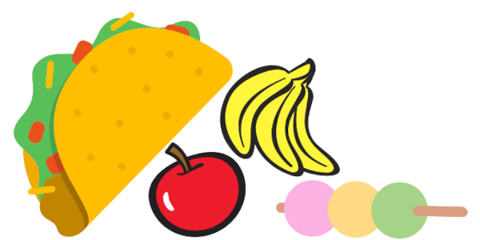
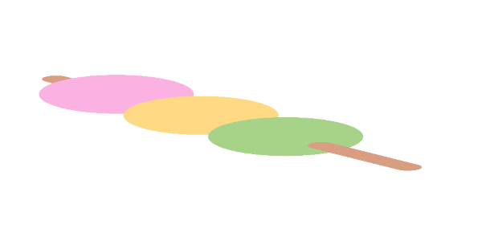
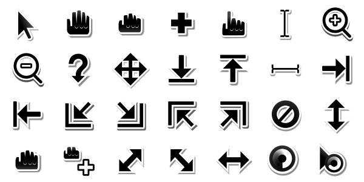

# Image attribution

## box2d.png

The taco, apple, and banana are from the Scratch sprite library. The dango is is from [Twemoji](https://twemoji.twitter.com/) and is licensed under [CC-BY 4.0](https://creativecommons.org/licenses/by/4.0/).

## stretch.png

The dango is is from [Twemoji](https://twemoji.twitter.com/) and is licensed under [CC-BY 4.0](https://creativecommons.org/licenses/by/4.0/).

## cursor.svg

The cursors are from the [Adwaita icon theme](https://gitlab.gnome.org/30butlerj/adwaita-icon-theme/-/tree/master/Adwaita/cursors) created by the GNOME project licensed under [CC-BY-SA 3.0](https://creativecommons.org/licenses/by-sa/3.0/). We use the SVG versions from https://github.com/manu-mannattil/adwaita-cursors.

## gamepad.svg
The gamepad image is from https://pixabay.com/vectors/controller-gamepad-video-games-1784571/.
